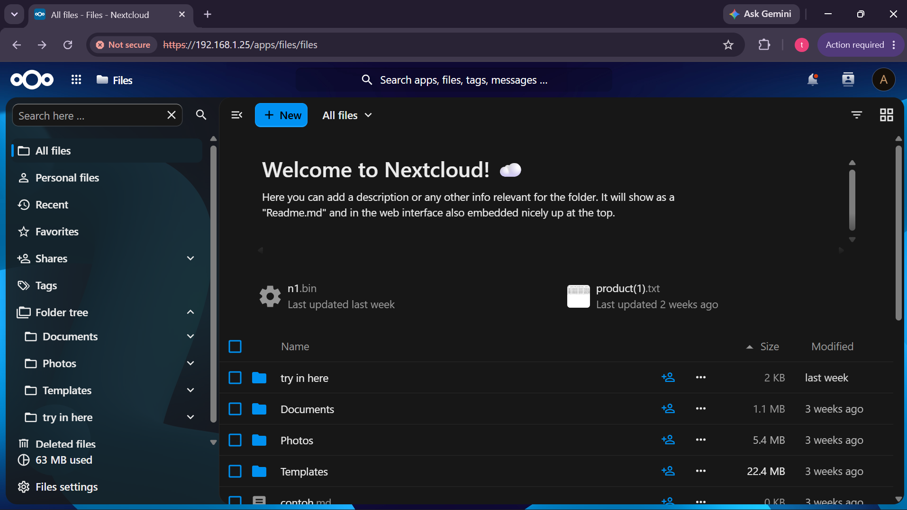
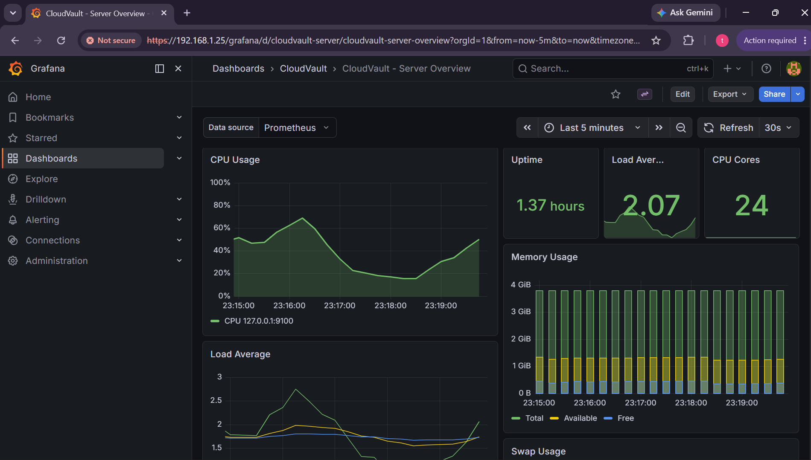

# CloudVault

**Enterprise-grade, self-hosted cloud storage platform built natively on Debian 13 (Trixie).**

CloudVault menggunakan **Nextcloud** sebagai aplikasi cloud storage dan **Nginx** sebagai gateway utama yang menangani traffic, SSL termination, security headers, rate limiting, dan performance tuning. Semua komponen diinstall langsung di OS via APT — **tanpa Docker, tanpa container**.

Project ini fokus pada **arsitektur web server, administrasi server Linux, deployment, security hardening, dan performance optimization**, bukan mengembangkan aplikasi cloud storage baru.

---

## 🎯 Masalah yang Memicu Pembuatan CloudVault

### 1. **Kecemasan Privasi Data & Ketergantungan Vendor (Vendor Lock-in)**
- **Penyimpanan cloud publik** (Google Drive, Dropbox, OneDrive, iCloud) menyimpan data di infrastruktur pihak ketiga yang tidak sepenuhnya transparan.
- Organisasi tidak memiliki kontrol penuh atas: lokasi fisik data, kebijakan akses pemerintah (mis. CLOUD Act, GDPR Schrems II), atau perubahan ToS/price hike mendadak.
- Migrasi keluar (egress) sering sulit, mahal, atau terbatas secara teknis.

### 2. **Biaya Berkelanjutan yang Tidak Terduga**
- Model *per-user/per-month* pada SaaS enterprise (Google Workspace, Microsoft 365, Box, Egnyte) mengakibatkan biaya operasional (OpEx) yang tumbuh linear dengan jumlah karyawan.
- Fitur *advanced security, DLP, eDiscovery, retention policies* terkunci di tier paling mahal.
- Tidak ada opsi *cap-ex* (belum investasi hardware sendiri) untuk organisasi yang punya tim infra & बजट hardware.

### 3. **Kurangnya Kontrol Keamanan & Kepatuhan (Compliance)**
- Cloud publik menawarkan *shared responsibility model* tapi konfigurasi keamanan granular (CSP header, rate limiting, cipher suite, WAF rules, antivirus scanning per-upload) sering *opinionated* atau tidak bisa di-*customize* penuh.
- Industri terregulasi (keuangan, kesehatan, pemerintahan, hukum) butuh bukti *audit trail* infrastruktur sendiri: *who accessed what, when, from where, scanned by what AV engine*.
- *Data residency* laws (UU PDP Indonesia, GDPR EU, HIPAA US) menuntut data tetap di yurisdiksi tertentu — cloud publik sering *multi-region* default.

### 4. **Kompleksitas & Overhead Docker/Kubernetes untuk Workload Sederhana**
- Banyak deployment Nextcloud modern *assume* Docker Compose / K8s (helm chart), yang menambah layer abstraksi, resource overhead, dan *failure domain* baru (container networking, volume drivers, image supply chain).
- Untuk tim infra yang sudah mahir Linux bare-metal (APT, systemd, Nginx, PHP-FPM, PostgreSQL), Docker justru menambah *cognitive load* tanpa manfaat isolasi yang signifikan untuk single-tenant app.
- *Immutable infrastructure* via container cocok untuk microservices skala besar, *overkill* untuk monolith stateful seperti Nextcloud.

### 5. **Ketiadaan "Batteries-Included" Production-Ready Template**
- Tutorial Nextcloud di internet mayoritas *development-grade*: SQLite, HTTP only, tanpa AV, tanpa backup terenkripsi, tanpa monitoring, tanpa hardening.
- Menggabungkan Nginx + PHP-FPM + PostgreSQL + Redis + ClamAV + Fail2ban + Prometheus + Backup terenkripsi + OCSP Stapling + Brotli + HSTS preload + rate limiting + log rotation + maintenance timer = **hari-hari kerja manual** yang rentan *drift* dan *human error*.
- Tidak ada *single source of truth* (config as code) yang *idempotent*, *version-controlled*, dan *tested* untuk di-deploy ulang kapan saja (disaster recovery, staging, scale-out).

---

## ✅ Mengapa Harus Memakai CloudVault (Solusi)

| Tantangan | Solusi CloudVault |
|-----------|-------------------|
| **Privasi & Soberanitas Data** | 100% *on-premise / self-hosted*. Data tidak pernah keluar server Anda. Tidak ada telemetri, tidak ada *third-party access*. |
| **Biaya Terprediksi (CapEx)** | Beli hardware sekali pakai. Hanya biaya listrik, bandwidth, & hardware refresh. *Zero license fee* — stack 100% open source (MIT/AGPL). |
| **Kontrol Keamanan Penuh** | Hardening *out-of-the-box*: TLS 1.3 only, HSTS preload, CSP, UFW default-deny, Fail2ban (Nextcloud + Nginx + SSH), ClamAV real-time scan, AppArmor, SSH key-only, Redis ACL, PG scram-sha-256. Semua config di `config/` — *auditable, versioned, reproducible*. |
| **Kepatuhan (Compliance)** | Audit trail lengkap: Nginx access/error log, Nextcloud audit log (`nextcloud.log`), Fail2ban ban log, ClamAV scan log, backup integrity log (SHA-256). Siap untuk *evidence package* auditor. |
| **Tanpa Docker / Container** | Semua via APT di Debian 13 (Trixie). Systemd native. *Lightweight, transparent, debuggable* — `systemctl status`, `journalctl`, `ss -ltnp` bekerja seperti biasa. |
| **Performance Production-Grade** | HTTP/2 + Brotli + keepalive, PHP-FPM pool tuned (JIT, opcache, realpath cache), PostgreSQL `random_page_cost=1.1` untuk NVMe, Redis `allkeys-lru`, Nginx `fastcgi_buffering off` untuk streaming upload/download >10GB. Benchmark terukur (lihat `benchmark/results/`). |
| **Operasional Otomatis** | - **Backup**: AES-256 + PBKDF2, retention 7/4/12 (daily/weekly/monthly), verify SHA-256 otomatis<br>- **Maintenance**: `occ cron` tiap 5 menit + daily `db:add-missing-indices`, `preview:pre-generate`, `files:scan --all` via systemd timer<br>- **Healthcheck**: `healthcheck.sh` cek service, disk, mem, SSL expiry, DB connectivity — output Prometheus-ready<br>- **Monitoring**: Prometheus + Grafana (loopback-only) + Alertmanager (disk >85%, service down, SSL <30 hari) |
| **Infrastructure as Code** | Semua config di `config/` + installer `scripts/install.sh` (wizard-driven, phased, idempotent). *GitOps-ready*: `git clone → sudo bash scripts/install.sh → 5 pertanyaan wizard → otomatis sampai selesai → ping Telegram`. Disaster recovery = `scripts/restore.sh` dari backup terenkripsi. |
| **Showcase Keahlian** | Project ini dibangun sebagai **portfolio bukti kompetensi**: Linux Server Admin, Web Server Architecture (Nginx tuning), Security Hardening (Fail2ban, UFW, TLS, AV), Performance Tuning (PHP, PG, Redis, Nginx), Infrastructure as Code (bash idempotent), Observability (Prometheus/Grafana). |

---

## 1. Tech Stack

| Layer          | Component / Teknologi                                              |
|----------------|--------------------------------------------------------------------|
| Web Server     | Nginx (HTTP/2, TLS 1.3, Brotli + Gzip, Rate Limiting)            |
| Application    | Nextcloud (latest stable)                                          |
| Runtime        | PHP 8.4 FPM                                                        |
| Database       | PostgreSQL 17 (tuned untuk SSD/NVMe)                              |
| Cache & Locks  | Redis 7 (memcache.local / distributed / locking)                  |
| TLS            | Let's Encrypt (Certbot) + OCSP Stapling                           |
| Security       | UFW + Fail2ban + ClamAV + AppArmor                                |
| Monitoring     | Prometheus + Grafana + Exporters                                  |
| Backup         | AES-256 Encrypted Archives + SHA-256 Verification + Retention     |
| Telegram Bot   | CloudVault Watchtower (real-time alerts & server status)          |


---

## 2. Screenshot / Demo

> **Placeholder** — Screenshot/GIF/video demo akan ditambahkan manual sebelum push ke GitHub.

| Tampilan | Deskripsi |
|----------|-----------|
|  | Dashboard Nextcloud setelah login |
|  | Monitoring dashboard Grafana |

**Video Demo:** [Demo in youtube](https://youtu.be/seR0e7_DhHE?si=Lz9v-fN7mVC4BGiC)

---

## 3. Cara Install & Menjalankan

### Prasyarat

- **OS:** Debian 13 (Trixie) fresh minimal install, root + non-root sudo user
- **Spec Minimum:** 2 vCPU / 4 GB RAM (8 GB recommended dengan ClamAV)
- **Storage:** 50 GB root + dedicated data volume untuk `/var/www/nextcloud/data`
- **Network:** Port 80, 443 (local network); Port 22 dari admin networks
- **TLS:** Self-signed certificate (Let's Encrypt butuh domain publik)

### Langkah-langkah Deployment

```bash
# 1. Ambil repository ke server (clone atau scp)
git clone https://github.com/wtfaboutyou/Cloud-Vault.git /opt/cloudvault
# (atau: scp -r cloudvault root@<server>:/opt/cloudvault)

# 2. Jalankan installer wizard (domain → email → password → Telegram)
cd /opt/cloudvault
sudo bash scripts/install.sh
```

Wizard menanyakan **5 input** (domain, email admin, password admin, Telegram bot
token, Telegram chat id) — **input terakhir = chat id**. Setelah itu deployment
berjalan **otomatis tanpa input**: phase 1–10 (packages, DB, Nextcloud,
TLS, security, ClamAV, backup, monitoring, watchtower, telegram) dan ditutup
dengan test ping **"🚀 CloudVault connected"** ke Telegram.

Tanpa domain publik, server memakai self-signed cert — akses via `https://<SERVER_IP>`.

```bash
# 3. Verifikasi instalasi
sudo bash scripts/healthcheck.sh
curl -skI https://localhost | grep -i strict-transport-security
```

### Update / maintenance (idempotent, aman diulang)

```bash
cd /opt/cloudvault && sudo bash scripts/install.sh update
```

Pulls repo terbaru, refresh Nginx, `occ upgrade` + `maintenance:repair`, refresh
timer/cron, refresh security monitoring, healthcheck — **tidak pernah menyentuh
data** (`config.php`/secret tidak ditulis ulang).

### Install Bertahap (Optional / Resume)

Gagal di satu phase? Jalankan ulang — idempotent, lanjut dari phase yang belum
selesai (kredensial di-reload dari `.secrets/*.env`):

```bash
# Phase 1: System preparation
sudo bash scripts/install.sh prep

# Phase 2: Core packages (PHP, Nginx, PostgreSQL, Redis, dll)
sudo bash scripts/install.sh packages

# Phase 3a: Database & Redis
sudo bash scripts/install.sh database

# Phase 3b: Nextcloud core
sudo bash scripts/install.sh nextcloud

# Phase 4: Nginx, TLS (self-signed), Brotli, PHP tuning
sudo bash scripts/install.sh web

# Phase 5: Security hardening (UFW, Fail2ban, SSH)
sudo bash scripts/install.sh security

# Phase 6: ClamAV & Maintenance timers
sudo bash scripts/install.sh features

# Phase 8: Backup infrastructure
sudo bash scripts/install.sh backup

# Phase 7: Monitoring (optional)
ENABLE_MONITORING=yes sudo bash scripts/install.sh monitoring

# Phase 9: Watchtower foundation (optional)
ENABLE_WATCHTOWER=yes sudo bash scripts/install.sh watchtower

# Phase 10: Telegram foundation (optional)
ENABLE_TELEGRAM=yes sudo bash scripts/install.sh telegram
```

### Post-Install Verification

```bash
# Cek status services
systemctl status nginx php8.4-fpm postgresql redis-server fail2ban clamav-daemon

# Health check lengkap
sudo bash /opt/cloudvault/scripts/healthcheck.sh

# Cek Nextcloud status
php /var/www/nextcloud/occ status

# Cek antivirus app aktif
sudo -u www-data php /var/www/nextcloud/occ app:list | grep -i antivirus

# Cek security headers
curl -skI https://localhost | grep -iE 'strict-transport|content-security'

# Demo 6 Advanced Features
sudo bash /opt/cloudvault/scripts/demo-features.sh
```

Buka `https://<SERVER_IP>` atau `https://localhost` (di server) dan login dengan kredensial admin. Browser akan warning self-signed cert — klik "Advanced" → "Proceed".

> Dokumentasi lengkap: [INSTALLATION.md](docs/INSTALLATION.md) | [AUTOMATION.md](docs/AUTOMATION.md) | [DEPLOYMENT.md](docs/DEPLOYMENT.md)

---

## 4. Link Demo Live

> **Self-hosted (local network)** — Project ini dijalankan di server sendiri, tidak di-hosting publik. Tanpa domain, akses via IP server.

Akses setelah instalasi:
- **Production:** `https://<SERVER_IP>` (contoh: `https://192.168.1.100`)
- **Grafana:** `https://<SERVER_IP>/grafana/` (jika monitoring sudah enabled)

> **Catatan:** Browser akan warning "Your connection is not private" karena self-signed certificate. Klik **Advanced → Proceed** untuk lanjut.


---

## 5. Link Edusoft Portfolio


- **Portfolio Page:** [Avrillia Zahra Khoirun Nisa](https://portfolio.edusoftcenter.com/contributors/1908d892-5a79-406a-b529-c2573398da59)

---

## Repository Structure

```
cloudvault/
├── README.md                    # Project overview (this file)
├── scripts/                       # Deployment & operations scripts
│   ├── install.sh              # Wizard installer (5 input → auto deploy phases 1-10)
│   ├── fail2ban-collector.sh   # Security metrics (fail2ban) → Prometheus
│   ├── backup.sh               # Encrypted backup + retention
│   ├── restore.sh              # Disaster recovery
│   ├── healthcheck.sh          # Service/disk/memory/SSL status
│   ├── healthcheck-prom.sh     # Prometheus-formatted healthcheck
│   ├── maintenance.sh          # Daily OCC maintenance tasks
│   └── benchmark/              # Benchmark scripts
├── config/                      # Production configuration files
│   ├── nginx/
│   ├── php/8.4/fpm/pool.d/
│   ├── postgresql/17/main/
│   ├── redis/
│   ├── fail2ban/
│   ├── ufw/
│   ├── prometheus/
│   └── grafana/dashboards/
├── docs/                        # Full documentation
│   ├── INSTALLATION.md
│   ├── DEPLOYMENT.md
│   ├── SYSTEM_ARCHITECTURE.md
│   ├── SECURITY.md
│   ├── PERFORMANCE.md
│   ├── BACKUP.md
│   ├── MONITORING.md
│   ├── DEMO_VIDEO.md
│   └── assets/                  # Screenshots, diagrams (to be added)
├── apps/                        # Custom Nextcloud apps (empty)
├── web/                         # Static web assets
│   └── demo/                    # Demo login page (portfolio showcase)
│       ├── index.html
│       └── assets/
└── benchmark/results/           # Benchmark output files
```

---

## Operations Cheat-Sheet

```bash
# Backup & Restore
sudo bash /opt/cloudvault/scripts/backup.sh            # Run backup now
sudo bash /opt/cloudvault/scripts/backup.sh verify     # Verify latest archive
sudo bash /opt/cloudvault/scripts/restore.sh           # Restore latest archive

# Health & Maintenance
sudo bash /opt/cloudvault/scripts/healthcheck.sh       # Full health report
sudo bash /opt/cloudvault/scripts/maintenance.sh       # Run maintenance manually

# Scheduled Tasks
systemctl list-timers cloudvault-*

# Watchtower (Telegram Bot)
sudo systemctl status cloudvault-watchtower            # Check service status
sudo systemctl restart cloudvault-watchtower           # Restart service
journalctl -u cloudvault-watchtower -f                 # Live logs
curl -s http://127.0.0.1:9191/health | python3 -m json.tool  # Health check

# 6 Advanced Features Demo
sudo bash /opt/cloudvault/scripts/demo-features.sh     # Run all 6 feature demos
```

---

## Documentation Index

| Document | Purpose |
|----------|---------|
| [INSTALLATION.md](docs/INSTALLATION.md) | Prerequisites + phased installation |
| [DEPLOYMENT.md](docs/DEPLOYMENT.md) | Post-install verification & go-live |
| [SYSTEM_ARCHITECTURE.md](docs/SYSTEM_ARCHITECTURE.md) | Architecture, flow, diagrams |
| [SECURITY.md](docs/SECURITY.md) | Hardening, firewall, Fail2ban, AV |
| [PERFORMANCE.md](docs/PERFORMANCE.md) | Tuning, compression, benchmarking |
| [BACKUP.md](docs/BACKUP.md) | Backup/restore strategy & recovery |
| [MONITORING.md](docs/MONITORING.md) | Prometheus, Grafana, alerting |

---

## Advanced Production Features (6)

1. **Intrusion Prevention** — Fail2ban integrate dengan Nginx logs dan Nextcloud `nextcloud.log` untuk auto-ban brute-force/credential-stuffing IPs via UFW.
2. **Brotli Compression + TLS 1.3 Hardening** — Strict cipher suites, HSTS preload, Perfect Forward Secrecy (target: A+ di SSL Labs).
3. **ClamAV Antivirus Auto-Scanning** — Setiap upload (Web, WebDAV, Desktop/Mobile clients) di-scan real-time oleh `clamd` sebelum disimpan.
4. **Automated OCC Maintenance** — Systemd timers jalan `cron.php` tiap 5 menit plus daily maintenance (`db:*`, `preview:pre-generate`, `files:scan --all`, orphan cleanup).
5. **Encrypted Backup dengan Retention & Integrity** — AES-256 encrypted archives, SHA-256 verification, rotation (7 daily / 4 weekly / 12 monthly).
6. **Centralized Health Checks & Grafana Alerting** — Automated health checks + Prometheus Alertmanager notifikasi saat service degradation atau storage >85%.

---

## CloudVault Watchtower — Telegram Bot Integration

Watchtower adalah layer integrasi operasional yang menghubungkan Telegram dengan infrastruktur monitoring CloudVault. Berjalan sebagai systemd service terpisah, Watchtower menyediakan real-time server status, health checks, metrics, storage info, alerts, dan event notifications langsung ke Telegram.

### Fitur Utama

| Fitur | Deskripsi |
|-------|-----------|
| **Telegram Bot Commands** | `/status`, `/health`, `/metrics`, `/storage`, `/jobs`, `/alerts` — semua read-only, authorization-based |
| **Account Linking** | Token kriptografis SHA-256, single-use, 10-minute expiry. Password tidak pernah dikirim ke Telegram |
| **Event Notifications** | Backup, upload, storage warning/critical, background job failures, dan alert kesehatan/keamanan — route ke semua user yang terhubung |
| **Alertmanager Webhook** | Menerima alert dari Prometheus Alertmanager, format untuk Telegram, deduplication 5 menit |
| **Notification Queue** | Redis-backed queue dengan exponential backoff retry, graceful degradation saat Redis unavailable |
| **Prometheus Metrics** | Watchtower expose metrik internal: notification count, queue depth, uptime, command requests |
| **Settings Page** | Web UI untuk connect/disconnect Telegram, manage notification preferences per event type |
| **9 Notification Types** | Upload completed/failed, Backup completed/failed, Health/Security alert, Storage Warning/Critical, Background Job failures |

### Sumber Event Notifikasi

| Event Type | Producer | Kapan terkirim |
|------------|----------|----------------|
| `BACKUP_COMPLETED` / `BACKUP_FAILED` | `backup.sh` | Backup harian/mingguan/bulanan selesai atau gagal |
| `UPLOAD_COMPLETED` / `UPLOAD_FAILED` | Nextcloud app `upload_notifier` | File berhasil di-upload/update, atau upload mulai tapi tidak selesai (mis. dibatalkan, koneksi putus, atau diblokir antivirus) |
| `STORAGE_WARNING` / `STORAGE_CRITICAL` | `healthcheck.sh` (via `healthcheck-prom.sh`, timer 5 menit) | Pemakaian disk ≥ 75% (warning) / ≥ 85% (critical); hanya dikirim saat state berubah |
| `BACKGROUND_JOB_FAILED` | `maintenance.sh`, `restore.sh` | Perintah occ maintenance gagal, atau restore gagal |
| `SECURITY_ALERT` / `HEALTH_ALERT` | Prometheus Alertmanager (webhook) | Rule alert fire (mis. service mati, SSL hampir kadaluarsa) |

App `upload_notifier` (untuk deteksi upload) ikut ter-deploy otomatis saat instalasi. Ada dua mekanisme `UPLOAD_FAILED`:

1. **Upload tidak pernah selesai** — pending upload yang mulai (hook `BeforeNode*`) tapi tidak ada event selesai, ditandai gagal setelah TTL (default 600 detik).
2. **Upload diblokir antivirus** — diterima langsung oleh `files_antivirus` sebelum file final terbentuk (tidak ada event file sama sekali), jadi dideteksi lewat catatan Activity `files_antivirus`/`virus_detected` di `oc_activity`; cursor `av_last_activity_id` memastikan tiap penolakan hanya dilaporkan sekali.

Konfigurasi opsional (via occ):

```bash
occ config:app:set upload_notifier watchtower_url --value="http://127.0.0.1:9191/api/events"
occ config:app:set upload_notifier failure_ttl --value="600"        # detik
occ config:app:set upload_notifier event_UPLOAD_FAILED --value="1"  # aktifkan event ini
occ config:app:set upload_notifier event_UPLOAD_COMPLETED --value="1"
occ config:app:set upload_notifier av_last_activity_id --value="0"  # reset cursor penolakan antivirus
```

### Arsitektur

```
Telegram User
     │
     ▼
Telegram Bot API ◄── webhook/polling ──► CloudVault Watchtower
                                              │
                                              ├──► Watchtower Internal API (port 9191)
                                              │       ├──► PostgreSQL (linking, preferences)
                                              │       ├──► Prometheus (metrics queries)
                                              │       └──► systemctl (service status)
                                              │
                                              ├──► Alertmanager Webhook (port 9093)
                                              │       └──► Prometheus Alert Rules
                                              │
                                              ├──► Notification Queue (Redis)
                                              │       └──► Exponential backoff retry
                                              │
                                              └──► Event Webhook (port 9191)
                                                      ├──► backup.sh, restore.sh
                                                      ├──► maintenance.sh, healthcheck.sh
                                                      └──► Nextcloud app upload_notifier (uploads)
```

### Perintah Bot

| Command | Auth | Deskripsi |
|---------|------|-----------|
| `/start` | No | Welcome message atau validasi linking token |
| `/help` | No | Daftar semua command |
| `/status` | Yes | Ringkasan operasional: CPU, memory, services, storage |
| `/health` | Yes | Kesehatan tiap komponen: Prometheus, Nginx, PostgreSQL, Redis, Fail2ban, ClamAV |
| `/metrics` | Yes | Metrik resource dari Prometheus: CPU, memory, disk utilization |
| `/storage` | Yes | Detail penggunaan disk: used, available, total, source |
| `/jobs` | Yes | Status background job: pg_cron dan systemd timers |
| `/alerts` | Yes | Alert aktif dari Alertmanager |

### Konfigurasi

```bash
# Environment variables (di /opt/cloudvault/.secrets/watchtower.env)
WATCHTELEGRAM_BOT_TOKEN=<token dari @BotFather>
WATCHTOWER_INTERNAL_API_KEY=<api key untuk internal API>
WATCHTOWER_POSTGRES_DSN=dbname=nextcloud user=nextcloud host=localhost

# Service management
sudo systemctl status cloudvault-watchtower
sudo systemctl restart cloudvault-watchtower
journalctl -u cloudvault-watchtower -f

# Settings page
https://<SERVER_IP>/settings/telegram/
```

---

## Repository Structure

```
cloudvault/
├── README.md                    # Project overview (this file)
├── scripts/                       # Deployment & operations scripts
│   ├── install.sh              # Wizard installer (5 input → auto deploy phases 1-10)
│   ├── backup.sh               # Encrypted backup + retention
│   ├── restore.sh              # Disaster recovery
│   ├── healthcheck.sh          # Service/disk/memory/SSL status
│   ├── healthcheck-prom.sh     # Prometheus-formatted healthcheck
│   ├── maintenance.sh          # Daily OCC maintenance tasks
│   ├── demo-features.sh        # 6 Advanced features demo script
│   ├── fail2ban-collector.sh   # Security metrics (fail2ban) → Prometheus
│   ├── benchmark/              # Benchmark scripts
│   └── watchtower/             # CloudVault Watchtower (Telegram integration)
│       ├── watchtower.py           # Main service (health, status, metrics, API)
│       ├── telegram_bot.py         # Telegram bot (webhook/polling, commands)
│       ├── telegram_linking.py     # Account linking (SHA-256 tokens, PostgreSQL)
│       ├── notification_queue.py   # Redis-backed notification queue
│       └── watchtower_metrics.py   # Prometheus metrics for Watchtower
├── config/                      # Production configuration files
│   ├── nginx/
│   ├── php/8.4/fpm/pool.d/
│   ├── postgresql/17/main/
│   ├── redis/
│   ├── fail2ban/
│   ├── ufw/
│   ├── prometheus/
│   ├── grafana/                # Grafana dashboards
│   └── watchtower/             # Watchtower systemd service
├── sql/                         # PostgreSQL schemas
│   └── telegram_link.sql           # Telegram linking tables
├── web/                         # Static web assets
│   ├── demo/                    # Demo login page (portfolio showcase)
│   │   ├── index.html
│   │   └── assets/
│   └── telegram/settings/       # Telegram settings page
│       ├── index.html
│       └── assets/
├── tests/                       # Test suite
│   ├── test_telegram_linking.py
│   ├── test_alertmanager_integration.py
│   ├── test_event_notifications.py
│   ├── test_notification_queue.py
│   └── test_watchtower_metrics.py
├── docs/                        # Full documentation
│   ├── INSTALLATION.md
│   ├── DEPLOYMENT.md
│   ├── SYSTEM_ARCHITECTURE.md
│   ├── SECURITY.md
│   ├── PERFORMANCE.md
│   ├── BACKUP.md
│   ├── MONITORING.md
│   └── DEMO_VIDEO.md
├── apps/                        # Custom Nextcloud apps (empty)
└── benchmark/results/           # Benchmark output files
```

---

## License

MIT License — bebas digunakan, dimodifikasi, dan didistribusikan.

---

**Dibangun untuk showcase keahlian:** Linux Server Administration, Web Server Architecture, Security Hardening, Performance Tuning, Infrastructure as Code.
