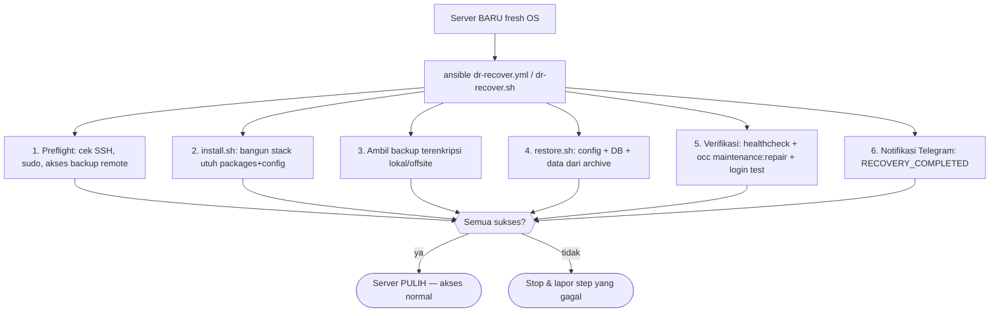

# IaC (Ansible) + Disaster Recovery — Rencana & Rekomendasi

Dokumen perencanaan sebagai tanggapan atas feedback mentor:

> "Tantangan berikutnya adalah bikin automation — cara install/deploy dengan
> sekali klik, bisa pakai ansiible/terraform (Infrastructure as Service / IaC).
> Lalu cara recovery secara cepat ketika terjadi disaster. Backup sudah dibuat
> & dienkripsi, tinggal bikin cara recovery-nya."

**Status: RENCANA UNTUK REVIEW — belum ada kode yang dieksekusi.**

---

## 1. Ringkasan Eksekutif

| Capaian yang diminta mentor | Kondisi saat ini | Gap yang harus ditutup |
|---|---|---|
| Install/deploy **sekali klik** dengan tool IaC standar industri | `scripts/install.sh` (wizard bash, idempotent) — jalan **di dalam** server target | Menambah lapisan **Ansible** sebagai control node → target, supaya deploy dari *luar* server dengan satu perintah |
| Recovery cepat saat bencana (disaster) | `scripts/restore.sh` — hanya **rollback** di server yang **masih hidup** | Menambah **bare-metal recovery**: server fresh OS → 1 perintah → hidup kembali total |
| Backup sudah dibuat & dienkripsi | Backup AES-256 + PBKDF2 + verify sudah ada | Recovery memanfaatkan backup ini, termasuk yang **offsite** |

Filosofi project tetap dihormati: **tanpa Docker, native APT, systemd**.

---

## 2. Kenapa Ansible (bukan Terraform) untuk Klien Ini

Mentor menyebut "ansible/terraform". Untuk konteks klien kita, rekomendasinya
**Ansible**, dengan alasan teknis & bisnis berikut:

| Kriteria | Ansible | Terraform | Keputusan |
|---|---|---|---|
| Target deployment | Bare-metal / on-premise / VM eksisting | Provisioning cloud provider (AWS/GCP/DO) | Project **self-hosted bare-metal** → Ansible |
| Sifat tool | **Configuration Management** (desired-state di mesin yang sudah ada) | **Infrastructure Provisioning** (menciptakan resource) | Backup & config sudah ada → butuh config management |
| Filosofi no-Docker | Pas dengan native APT + systemd | Netral, tapi kurang natural tanpa cloud | Ansible |
| Agent | Agentless (SSH) | Agentless | Setara |
| Kompleksitas setup | Satu control node, file YAML | Backend state + provider + credentials cloud | Ansible jauh lebih ringan |
| Reuse `install.sh` | Bisa memanggil fase-fase idempotent yang sudah ada | Tidak bisa langsung | Ansible besar keunggulan |
| Skill pasar/industri | Sangat umum sebagai config mgmt | Umum sebagai provisioning | Keduanya bernilai ~setara |

> **Keputusan:** **Ansible** sebagai deliverable utama IaC. Terraform tetap
> disebut di dokumen sebagai opsi lanjutan (opsional) bila klien suatu saat
> pindah ke cloud — tapi bukan fokus sekarang.

---

## 3. Rencana Arsitektur

### 3.1 Model kontrol (control node → target)

```
Control Node (laptop / CI runner / jump host)
   └── ansible-playbook deploy.yml -i inventory/hosts.yml
         │  (SSH, agentless, no agent di target)
         ▼
Target = server CloudVault (Debian 13)
   ├── [] git clone / scp repo → /opt/cloudvault
   ├── [] menjalankan scripts/install.sh  (fase idempotent 1–10)
   └── [] healthcheck.sh  (persist, but idempotent)
```

Dua peran dalam satu playbook:

| Play | Fungsi |
|---|---|
| `bootstrap` | Pastikan SSH, sudo, base package terpasang di target (bisa fresh OS) |
| `deploy_cloudvault` | Push repo + jalankan `install.sh` (wizard dimatikan → `ENV` variabel → `all`), lalu `healthcheck.sh` sebagai verifikasi |

### 3.2 Struktur direktori yang diusulkan

```
cloudvault/
└── ansible/
    ├── ansible.cfg            # inventory default, ssh params, timeout
    ├── inventory/
    │   ├── hosts.yml          # [cloudvault] target hosts + variabel
    │   └── group_vars/
    │       └── all.yml        # domain, email, enable_monitoring, dll (rahasia dari vault)
    ├── playbooks/
    │   ├── deploy.yml         # bootstrap + deploy + healthcheck
    │   ├── update.yml         # install.sh update (idempotent)
    │   ├── dr-recover.yml     # bare-metal disaster recovery dari backup
    │   └── site.yml           # (opsional) agregasi deploy + DR
    ├── roles/
    │   ├── cloudvault_bootstrap/   # base OS, ssh, swap (meminjam fase 1-2)
    │   ├── cloudvault_deploy/      # push repo + jalankan install.sh
    │   └── cloudvault_dr/          # restore bare-metal + verify
    └── vars/
        └── secret.example.yml # template variabel rahasia (token, password)
```

> **Prinsip reuse:** Ansible **tidak menulis ulang** fase-fase yang sudah ada di
> `install.sh` (risiko regression & duplikasi). Ia meng-*orchestrate*: push repo,
> set environment, jalankan phase yang idempotent. Ini meminimalkan risiko dan
> menjaga satu single-source-of-truth di `config/` + `scripts/`.

---

## 4. Rencana Disaster Recovery (Bare-Metal)

### 4.1 Konsep — bedanya dengan `restore.sh` yang sekarang

| | `restore.sh` (ada sekarang) | `dr-recover` (usulan) |
|---|---|---|
| Target | Server yang **masih hidup** | Server **fresh OS / mati total** |
| Yang di-restore | config + DB + data | OS packages **+** config + DB + data |
| Sumber backup | Backup **lokal** | Backup **lokal dan/atau offsite** (remote) |
| Cara | Script bash manual | **Satu perintah** (`ansible-playbook` atau `dr-recover.sh`) |

`dr-recover` = gabungan `install.sh` (bangun stack utuh) **+** `restore.sh`
(pulihkan data), divisualkan dalam satu alir idempotent.

### 4.2 Alur DR (RTO target: idealnya < 1 jam, data loss RPO = sesuai backup)



### 4.3 Komponen DR yang diusulkan

1. **Playbook `dr-recover.yml`** — orkestrasi langkah 1–5.
2. **`scripts/dr-recover.sh`** *(opsional, mode manual)* — versi bash jalan sendiri
   di server tanpa Ansible, agar DR tetap bisa dijalankan walau control node mati.
3. **Ambil backup offsite** — menyempurnakan rekomendasi `rclone` yang sudah ada
   di docs: kredensial remote disimpan terpisah, `rclone copy` backup ke remote
   setelah tiap backup, dan `dr-recover` bisa menarik dari remote.
4. **Enkripsi & key**: archive sudah AES-256; `dr-recover` butuh **backup key**
   (`/etc/cloudvault/backup.key`). Key disediakan dari kontrol/vault saat DR —
   tidak disimpan di server yang direcovery.

### 4.4 (Opsional) Recovery dalam 2 tier

| Tier | Skenario | Cara |
|---|---|---|
| **Tier 1 — Application restore** | Server hidup, stack rusak / data kosong | `restore.sh` (sudah ada) |
| **Tier 2 — Full bare-metal restore** | Server mati total / disk rusak / pindah host | `dr-recover.yml` (usulan) |

---

## 5. Pengujian & Runbook (yang harus dimiliki industri)

1. **Uji DR berkala (misal bulanan)** — restore ke **staging** instance,
   `occ maintenance:repair`, verifikasi admin login + sampel file hash.
2. **Uji restore-tidak-mengganggu** — `restore.sh verify` (decript + tar test)
   sudah ada; jadikan bagian dari rutinitas.
3. **Runbook terdedikasi** — `docs/DISASTER_RECOVERY.md` berisi prosedur
   langkah-demi-langkah, RTO/RPO target, daftar kontak, dan cheklis pemulihan.
4. **Notifikasi** — `RECOVERY_COMPLETED`/`RECOVERY_FAILED` via Watchtower → Telegram
   (mengikuti pola existing `BACKGROUND_JOB_FAILED`).

---

## 6. Risiko & Kompromi (dijelaskan jujur)

| Risiko | Mitigasi |
|---|---|
| Ansible memanggil `install.sh` bukan mengelola setiap file declaratively | Diterima: mengurangi duplikasi & regression; `install.sh` sudah idempotent & version-controlled. Sifat "declarative enough" tetap ada karena `.secrets/*.env` + variabel grup di Ansible. |
| Butuh control node + SSH key ke target | Satu control node (laptop/runner) cukup; SSH key + vault menyimpan rahasia. |
| Backup offsite belum terimplementasi | Masuk scope: implementasi `rclone` offsite untuk melengkapi skenario DR total. |
| DR tidak lolos tanpa key & remote backup | Dokumentasi tegas: key & backup offsite WAJIB disimpan di luar server. |

---

## 7. Deliverable Akhir (yang akan dibuat jika disetujui)

1. `ansible/` — `ansible.cfg`, inventory, `group_vars`, 3 playbooks (`deploy`,
   `update`, `dr-recover`), dan 3 roles. Termasuk `vars/secret.example.yml`
   (template, rahasia di-anonymize).
2. `scripts/dr-recover.sh` — fallback DR tanpa Ansible.
3. Sempurnakan `BACKUP.md`/`restore.sh` untuk dukungan backup offsite (rclone).
4. `docs/DISASTER_RECOVERY.md` — runbook lengkap (RTO/RPO, prosedur, pengujian).
5. Update `README.md` + `docs/` index untuk menunjuk ke bagian IaC & DR baru.
6. *(Opsional)* `.github/workflows/iac-validate.yml` — lint YAML + `--syntax-check`
   playbook di CI agar ter-testing.

---

## 8. Rekomendasi Keputusan ke Mentor

Rekomendasi yang diajukan:

- **IaC**: Ansible (bukan Terraform) — sesuai bare-metal, reuse install.sh,
  ringan, dan langsung menunjukkan konfigurasi managemen yang dituntut industri.
- **DR**: 2-tier (application restore + full bare-metal recover) dengan
  `dr-recover` satu-perintah, didukung backup **offsite** (rclone).
- **Deliverable**: kode Ansible + `dr-recover.sh` + runbook `DISASTER_RECOVERY.md`
  + test CI berupa `--syntax-check`.

**Pertanyaan terbuka untuk mentor/klien sebelum eksekusi:**
1. Ansible dipakai sebagai *orchestrator* atas `install.sh` (disarankan), atau
   mau di-refactor penuh ke role per-komponen (lebih besar & berisiko regression)?
2. Apakah offsite backup (rclone) ikut diimplementasikan sekarang, atau cukup
   di dokumentasikan?
3. Setuju DR dilakukan via playbook + fallback bash script?
